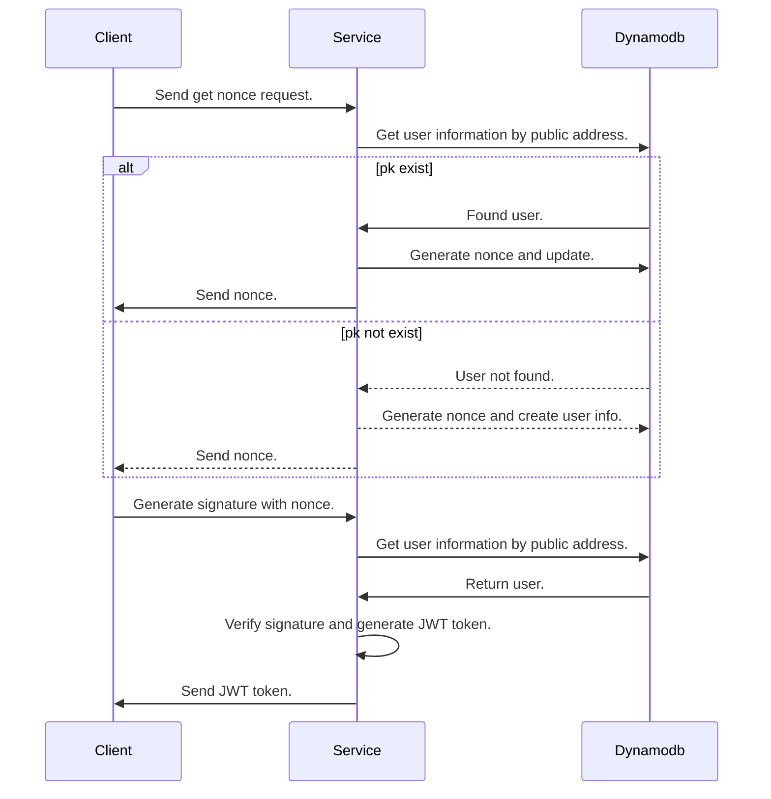

# Web3 Auth

Using the crypto wallet to authenticate.

## Table

| #   | access pattern         | target | action      | pk                    | sk                        | done               |
| --- | ---------------------- | ------ | ----------- | --------------------- | ------------------------- | ------------------ |
| 1   | get user information   | table  | get item    | USER#`public_address` | #PROFILE#`public_address` | :white_check_mark: |
| 2   | set user               | table  | put item    | USER#`public_address` | #PROFILE#`public_address` | :white_check_mark: |
| 3   | update user infomation | table  | update item | USER#`public_address` | #PROFILE#`public_address` | :white_check_mark: |

## Flow

